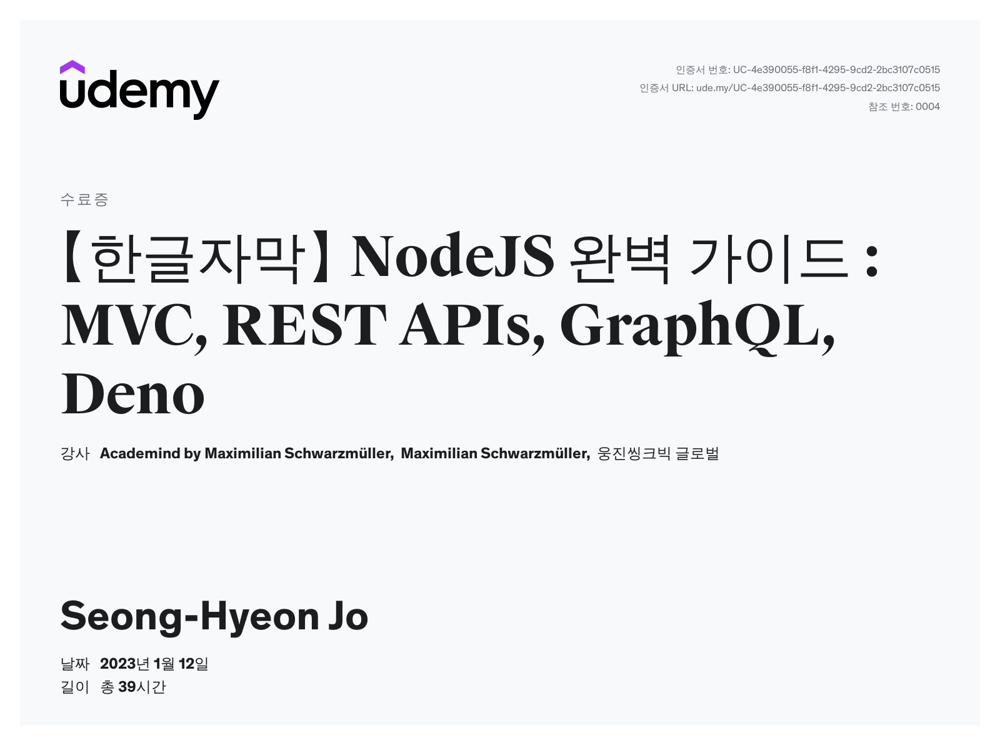

# 자료 설명
### 해당 자료는 지금까지 배운 MERN 스택의 핵심인 NodeJS의 기술을 복습하는 자료입니다.
### 파일 마다 제공하는 내용은 아래와 같으니 참고해주시길 바랍니다.
 
 

# NodeJS_File
## NodeJS(v16) 커리큘럼

### - Express.js 활용

### - Express.js REST API 구축

### - Express.js REST API 내 인증 구현

### - Express.js REST API 내 파일 업로드

### - Express.js GraphQL API 구축

### - Express.js GraphQL API 내 인증 구현

### - Express.js GraphQL API 내 파일 업로드

### - Express.js Websocket을 통해 실시간 Node.js 앱 구축하기

### - Express.js 테스트 자동화 (유닛 테스트)

### - Express.js with TypeScript

### - NestJS 활용

### - NestJS REST API 구축

### - NestJS REST API 내 인증 구현

### - NestJS REST API 내 파일 업로드

### - NestJS GraphQL API 구축

### - NestJS GraphQL API 내 인증 구현

### - NestJS GraphQL API 내 파일 업로드

### - NestJS Websocket을 통해 실시간 Node.js 앱 구축하기

### - NestJS 테스트 자동화 (유닛 테스트)

### - Node.js 애플리케이션 배포
 

## NodeJS 과정 수료증

 
 